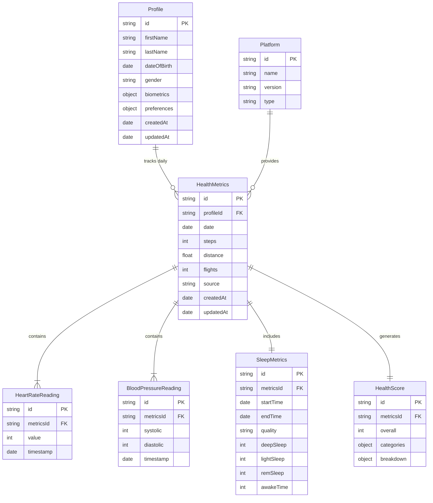

```mermaid
erDiagram
    Profile ||--o{ HealthMetrics : "tracks daily"
    Profile {
        string id PK
        string firstName
        string lastName
        date dateOfBirth
        string gender
        object biometrics
        object preferences
        date createdAt
        date updatedAt
    }

    HealthMetrics ||--|{ HeartRateReading : "contains"
    HealthMetrics ||--|{ BloodPressureReading : "contains"
    HealthMetrics ||--|| SleepMetrics : "includes"
    HealthMetrics ||--|| HealthScore : "generates"
    HealthMetrics {
        string id PK
        string profileId FK
        date date
        int steps
        float distance
        int flights
        string source
        date createdAt
        date updatedAt
    }

    HeartRateReading {
        string id PK
        string metricsId FK
        int value
        date timestamp
    }

    BloodPressureReading {
        string id PK
        string metricsId FK
        int systolic
        int diastolic
        date timestamp
    }

    SleepMetrics {
        string id PK
        string metricsId FK
        date startTime
        date endTime
        string quality
        int deepSleep
        int lightSleep
        int remSleep
        int awakeTime
    }

    HealthScore {
        string id PK
        string metricsId FK
        int overall
        object categories
        object breakdown
    }

    Platform ||--o{ HealthMetrics : "provides"
    Platform {
        string id PK
        string name
        string version
        string type
    }
```
